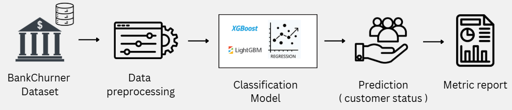

# Bank Customer Churn Prediction

## Overview
This project predicts whether a bank customer is likely to churn (leave the bank). The notebook follows a full machine learning workflow from data inspection and visualization to preprocessing, model training, and performance evaluation.

## Goal
The objective is to build a classification model that identifies customers at risk of attrition so the bank can take timely retention actions.

## Dataset
The project uses the BankChurners dataset, which includes customer demographics, account activity, and card usage information.

### Target Variable
- `Attrition_Flag`
  - `Existing Customer`
  - `Attrited Customer`

### Data Dict
| Feature | Description |
|---|---|
| `Customer_Age` | Age of the customer |
| `Gender` | Customer gender |
| `Dependent_count` | Number of dependents |
| `Education_Level` | Highest education level |
| `Marital_Status` | Marital status |
| `Income_Category` | Income range |
| `Card_Category` | Credit card type |
| `Months_on_book` | Number of months with the bank |
| `Total_Relationship_Count` | Number of bank products held |
| `Months_Inactive_12_mon` | Inactive months in last year |
| `Contacts_Count_12_mon` | Customer contacts in last year |
| `Credit_Limit` | Credit limit |
| `Total_Revolving_Bal` | Revolving balance |
| `Avg_Open_To_Buy` | Available credit remaining |
| `Total_Amt_Chng_Q4_Q1` | Change in transaction amount between Q4 and Q1 |
| `Total_Trans_Amt` | Total transaction amount |
| `Total_Trans_Ct` | Total transaction count |
| `Total_Ct_Chng_Q4_Q1` | Change in transaction count between Q4 and Q1 |
| `Avg_Utilization_Ratio` | Credit utilization ratio |

## Workflow Summary
The notebook follows this pipeline:



1. Load the dataset and inspect its structure
2. Remove irrelevant or identifier columns such as `CLIENTNUM` and the two naive Bayes classifier columns
3. Perform exploratory data analysis (EDA)
   - customer age distribution by churn status
   - revolving balance trends
   - transaction activity vs. contact frequency
   - correlation analysis
4. Drop redundant features if needed (for example, highly correlated credit features)
5. Encode categorical variables using one-hot encoding
6. Split the data into training and testing sets
7. Scale numeric features
8. Train multiple classifiers
   - Logistic Regression
   - XGBoost
   - LightGBM
9. Evaluate the models using accuracy, precision, recall, F1-score, and classification reports

## Sample Data Preview
A quick look at the first few rows (`df.head()`) shows the dataset contains both customer behavior features and the target label. Each row represents one customer, and the notebook uses these columns to learn patterns that separate existing customers from churned customers.

Example structure of the first rows:

```text
Customer_Age | Gender | Education_Level | Marital_Status | Income_Category | Card_Category | Months_on_book | Total_Relationship_Count | Months_Inactive_12_mon | Contacts_Count_12_mon | Credit_Limit | Total_Revolving_Bal | Avg_Open_To_Buy | Total_Amt_Chng_Q4_Q1 | Total_Trans_Amt | Total_Trans_Ct | Total_Ct_Chng_Q4_Q1 | Avg_Utilization_Ratio | Attrition_Flag
```

## Key Insights Explored
- Relationship between customer age and churn
- Impact of revolving balance on churn likelihood
- Connection between transaction activity and customer contact frequency
- Correlation between important financial features
- Class imbalance effects on model performance

## Models Used
The notebook evaluates several classifiers, including:
- Logistic Regression
- XGBoost
- LightGBM

## Evaluation Metrics
The project uses:
- Accuracy
- Precision
- Recall
- F1-score
- Classification report

## Dependencies
The notebook requires libraries such as:
- pandas
- numpy
- matplotlib
- seaborn
- scikit-learn
- xgboost
- lightgbm

## How to Run
1. Install the required dependencies
2. Open the notebook in Jupyter or VS Code
3. Run all cells in order
4. If the dataset is compressed, unzip it before loading

## Expected Outcome
The project aims to provide a reliable churn prediction model and useful insights into which customer behaviors are most associated with attrition.
